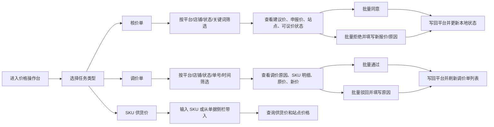
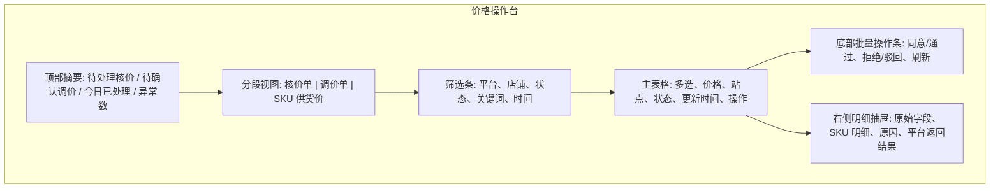

# Pricing Operations Workbench UX

## Product Positioning

核价/调价模块是多平台聚合运营工具里的价格操作台。平台适配层当前先接 Temu，页面文案和信息架构保留扩展到其他平台的空间。

## Primary Workflow

## Screen Layout

## Interaction Rules

- 核价单和调价单都默认显示待处理状态，避免运营先看到已完成历史。
- 写入动作必须二次确认；拒绝/驳回必须填写原因。
- 页面统一显示「平台」「店铺」「托管类型」「区域」，避免 Temu 细节渗透成产品边界。
- 单条操作与批量操作共用同一后端接口，降低行为差异。
- 平台返回失败时保留行级错误，不阻塞其他行继续处理。

## Temu Adapter Coverage

| Area | Temu API |
| --- | --- |
| 核价单查询 | `bg.price.review.page.query`, `bg.semi.price.review.page.query.order` |
| 核价单同意 | `bg.price.review.confirm`, `bg.semi.price.review.confirm.order` |
| 核价单拒绝 | `bg.price.review.reject`, `bg.semi.price.review.reject.order` |
| 调价单查询 | `bg.full.adjust.price.page.query`, `bg.semi.adjust.price.page.query`, `bg.semi.adjust.price.page.query.order` |
| 调价单审批 | `bg.full.adjust.price.batch.review`, `bg.semi.adjust.price.batch.review`, `bg.semi.adjust.price.batch.review.order` |
| 供货价查询 | `bg.goods.price.list.get`, `bg.glo.goods.price.list.get` |
